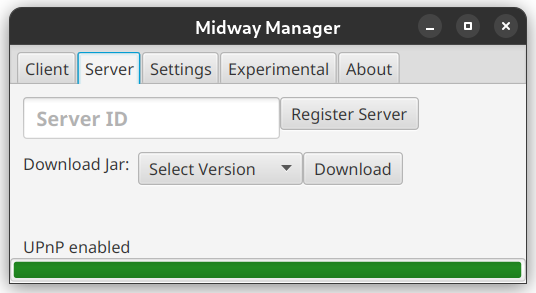
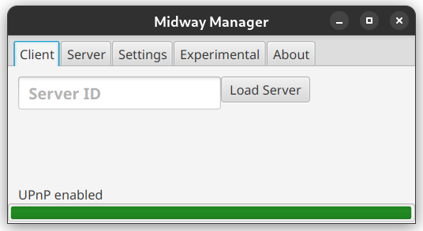

## [**Downloads**](https://github.com/jetfire725/midway-server-manager/releases)
## What is it?

Midway Server Manager is an all-in-one minecraft server and client utility created to make hosting your own worlds easier than ever. With Midway, you can download new server jars when they release, utilize UPnP, eliminating the need to configure router port forward settings, and configure code names for your server, to allow your friends to join with the click of a button!

### **Server Mode**
Server mode lets you easily download minecraft server Jars from official sources, enjoy automatic UPnP, meaning no annoying port forwarding required for servers running on the same machine, and register your server with a unique ID your friends can use to join your world without the need for inputting IP addresses. 

### **Client Mode**
Client mode lets you connect to servers that have registered a unique ID. Loading servers from Midway will automatically retrieve the connection properties, and create a server entry in your Minecraft multiplayer menu!

